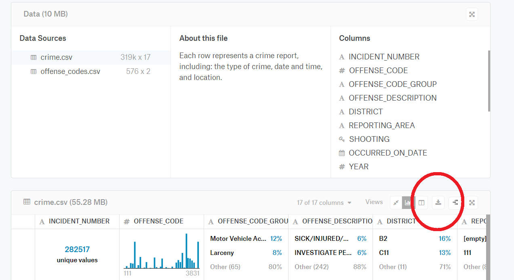
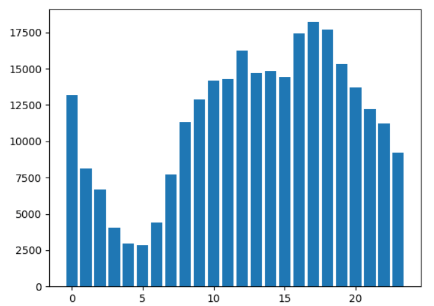
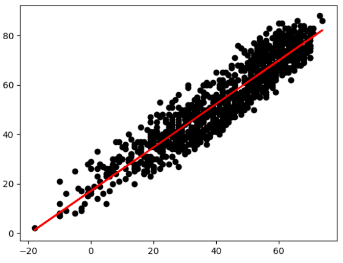

# Analysis and Forecasting on Boston Crime Data
We do an exploratory data analysis on a Boston crime dataset from Kaggle, focusing on crime over time. Then we merge this with
a Boston weather dataset and try to forecast crimes per hour.


## Set up dependencies
We will use [CUDA](https://en.wikipedia.org/wiki/CUDA) to let our GPU speed up the training of the networks. This requires 
an Nvidia graphics card. Everything in this tutorial can still be done without it, but it will run a lot slower (about 10 to
20 times slower). If doing this without CUDA, make sure to replace the CuDNNLSTM layers with regular LSTM. Guides for installing 
CUDA can be [found here](https://docs.nvidia.com/cuda/index.html).

Download [Anaconda](https://www.anaconda.com/distribution/) for Python 3 if you dont have it. Anaconda let's us set an environment for 
the project that uses specific versions of our dependencies, even if we have other versions of that software elsewhere.

Make a folder called `boston_crime` and in it a file called `environment.yml`. These are the dependencis 
we will require, paste this into the environment file:
```python
name: boston
dependencies:
  - python=3.6.6
  - numpy=1.16
  - tensorflow-gpu=1.14
  - matplotlib=3.1
  - pandas=0.25.1
  - scikit-learn=0.21
  - keras>=2.2,<2.3
  - h5py<3
  - pip:
    - mlflow[extras]==1.2.0
    - mflux-ai>=0.5.1
```

Open an Anaconda prompt, navigate to the `boston_crime` folder and run `conda env create -f environment.yml`. Now activate 
this environment by running `conda activate boston`.

## Download datasets
Inside the folder `boston_crime`, create a folder called `data`.
From Kaggle, download the datasets [crime.csv and offense_codes.csv](https://www.kaggle.com/AnalyzeBoston/crimes-in-boston)
concerning crimes in Boston between 2015 and 2018, as well as the dataset [Boston weather](https://www.kaggle.com/jqpeng/boston-weather-data-jan-2013-apr-2018).



In the folder `data`, extract/paste these datasets into files
* `raw_crime_data.csv`
* `offense_codes.csv`
* `raw_weather_data.csv`

The file `offense_codes.csv` is not strictly necessary, but is nice to have for context.


## Prepare data for Exploration
In this part we will examine any data that could give a network help with predictions. We will run some tests to look for 
correlations and afterwards we can drop any data that is unlikely to help in forecasting. Make a file called 
`prepare_data.py`. We will use the following imports.
```python
import os
import joblib

import mflux_ai
import numpy as np
import pandas as pd
from sklearn.preprocessing import StandardScaler

# load raw crime and weather data
crime_data = pd.read_csv('data/raw_crime_data.csv', encoding='windows-1252')
weather_data = pd.read_csv('data/raw_weather_data.csv')
```

The raw crime data is a bit messy. We can observe the file directly by opening it, or print part of it with
```python
print(crime_data)
```

Currently our print looks something like this, with 17 columns:
```
       INCIDENT_NUMBER  OFFENSE_CODE    OFFENSE_CODE_GROUP  ...        Lat       Long                     Location
0           I182070945           619               Larceny  ...  42.357791 -71.139371  (42.35779134, -71.13937053)
1           I182070943          1402             Vandalism  ...  42.306821 -71.060300  (42.30682138, -71.06030035)
2           I182070941          3410                 Towed  ...  42.346589 -71.072429  (42.34658879, -71.07242943)
3           I182070940          3114  Investigate Property  ...  42.334182 -71.078664  (42.33418175, -71.07866441)
4           I182070938          3114  Investigate Property  ...  42.275365 -71.090361  (42.27536542, -71.09036101)
...                ...           ...                   ...  ...        ...        ...                          ...
319068   I050310906-00          3125       Warrant Arrests  ...  42.336951 -71.085748  (42.33695098, -71.08574813)
319069   I030217815-08           111              Homicide  ...  42.255926 -71.123172  (42.25592648, -71.12317207)
319070   I030217815-08          3125       Warrant Arrests  ...  42.255926 -71.123172  (42.25592648, -71.12317207)
319071   I010370257-00          3125       Warrant Arrests  ...  42.302333 -71.111565  (42.30233307, -71.11156487)
319072       142052550          3125       Warrant Arrests  ...  42.333839 -71.080290  (42.33383935, -71.08029038)

[319073 rows x 17 columns]
```

Let's clean it up a little and save a prettier version in case we want to look at it.
```python
# select only necessary columns from crime data and do some relabeling
crime_data = crime_data[['OFFENSE_CODE_GROUP', 'SHOOTING', 'OCCURRED_ON_DATE', 'DAY_OF_WEEK', 'HOUR', 'UCR_PART']]
crime_data.UCR_PART = crime_data.UCR_PART.replace(['Part One', 'Part Two', 'Part Three', 'Other', np.nan],
                                                  ['One', 'Two', 'Three', 'Other', 'NR'])
crime_data.SHOOTING = crime_data.SHOOTING.replace([np.nan, 'Y'], [0, 1])
crime_data = crime_data.rename(columns={'OFFENSE_CODE_GROUP': 'Type', 'SHOOTING': 'Shooting', 'OCCURRED_ON_DATE': 
                                        'Date', 'DAY_OF_WEEK': 'Weekday', 'HOUR': 'Hour', 'UCR_PART': 'UCR'})
# save the new crime dataframe
crime_data.to_csv(os.path.join('data', 'crime_data.csv'), index=False)
```

If we print it again, it now looks like this:
```
                        Type  Shooting                 Date   Weekday  Hour    UCR
0                    Larceny         0  2018-09-02 13:00:00    Sunday    13    One
1                  Vandalism         0  2018-08-21 00:00:00   Tuesday     0    Two
2                      Towed         0  2018-09-03 19:27:00    Monday    19  Three
3       Investigate Property         0  2018-09-03 21:16:00    Monday    21  Three
4       Investigate Property         0  2018-09-03 21:05:00    Monday    21  Three
...                      ...       ...                  ...       ...   ...    ...
319068       Warrant Arrests         0  2016-06-05 17:25:00    Sunday    17  Three
319069              Homicide         0  2015-07-09 13:38:00  Thursday    13    One
319070       Warrant Arrests         0  2015-07-09 13:38:00  Thursday    13  Three
319071       Warrant Arrests         0  2016-05-31 19:35:00   Tuesday    19  Three
319072       Warrant Arrests         0  2015-06-22 00:12:00    Monday     0  Three

[319073 rows x 6 columns]
```
Much more readable, although we have discarded a lot of data. The columns "OFFENSE_CODE", "DISTRICT", "REPORTING_AREA", 
"STREET" and "Location" all have information we may wish to look into later.

In `weather_data`, we need to make a datetime index in preparation for merging into a dataframe with crimes per hour (or day).
We can also drop the "Events" column.
```python
# make a datetime index from Year, Month and Day columns in weather data. drop events column
weather_data = weather_data.rename(columns={'Year': 'year', 'Month': 'month', 'Day': 'day'})
weather_data['Date'] = pd.to_datetime(weather_data[['year', 'month', 'day']])
weather_data = weather_data.drop(['Events'], axis=1)
weather_data = weather_data.set_index('Date')
```

A print of `weather_data` now looks something like this:
```
            year  month  day  High Temp (F)  ...  Avg Wind (mph)  High Wind Gust (mph)  Snowfall (in)  Precip (in)
Date                                         ...
2008-01-01  2008      1    1             40  ...              10                    36           0.18         0.18
2008-01-02  2008      1    2             33  ...              15                    38           0.00         0.00
2008-01-03  2008      1    3             14  ...              17                    32           0.00         0.00
2008-01-04  2008      1    4             32  ...              12                    28           0.00         0.00
2008-01-05  2008      1    5             42  ...               9                    23           0.00         0.00
...          ...    ...  ...            ...  ...             ...                   ...            ...          ...
2018-04-04  2018      4    4             58  ...              13                    42           0.00         0.20
2018-04-05  2018      4    5             43  ...              22                    44           0.00         0.00
2018-04-06  2018      4    6             43  ...              11                    26           0.21         0.21
2018-04-07  2018      4    7             47  ...              12                    27           0.00         0.01
2018-04-08  2018      4    8             42  ...              13                    29           0.00         0.00

[3749 rows x 23 columns]
```

We have two dataframes. The crime data has individual crimes as rows and various information as columns. 'Date' is a column and
the various types of crime are entries in the column 'Type'. We want the input data for a network in a shape more like the
weather data, with time as the row index and each type of crime as its own column. The entries will be number of occurrences 
per timestep. To make this dataframe, we will prepare the row index and column names, make an empty dataframe, and then fill 
it in.

Prepare a list of datetimes spanning the crime data. We will make one frame with intervals of one hour, and one with intervals of
one day. The lists `hours` and `days` will become the indexes of these dataframes.
```python
crime_data.Date = pd.to_datetime(crime_data.Date)
crime_data.Date = crime_data.Date.dt.floor('1H')
# prepare row index of time series dataframe
start_date = crime_data.Date.sort_values().iloc[0]
weather_data = weather_data.loc[start_date:]
end_date = crime_data.Date.sort_values().iloc[-1]
hours = pd.date_range(start_date, end_date, freq='H')
days = pd.date_range(start_date, end_date, freq='D')
```

We create the hourly and daily dataframe skeletons, meaning the row index and column names are in place, but they have no
data yet.
```python
# create time series dataframe skeletons
columns = crime_data.Type.unique()
crime_by_hour = pd.DataFrame(index=hours, columns=columns)
crime_by_day = pd.DataFrame(index=days, columns=columns)
```

Now we start filling in the data.
```python
# find and add nonzero cells in time series dataframes
for col in columns:
    crime_by_hour[col] = crime_data[crime_data.Type == col].Date.value_counts()
    crime_by_day[col] = crime_data[crime_data.Type == col].Date.dt.floor('1D').value_counts()
crime_by_hour = crime_by_hour.fillna(0)
crime_by_day = crime_by_day.fillna(0)
# add a column for total crime
crime_by_hour['Total'] = crime_by_hour.sum(axis=1)
crime_by_day['Total'] = crime_by_day.sum(axis=1)
```

The dataframe `hourly_input` only has weather for the first hour per day, and both dataframes have data for some months past
the last weather data. We fix this with
```python
hourly_input = crime_by_hour.join(weather_data).fillna(method='ffill')
daily_input = crime_by_day.join(weather_data).dropna()
last_weather_hour = daily_input.iloc[-1].name + pd.to_timedelta('23 hours')
hourly_input = hourly_input[:last_weather_hour]
```

We want include some columns of time data:
```python
# add and rename time data columns
crime_by_hour['Hour'] = crime_by_hour.index.hour
crime_by_hour['Weekday'] = crime_by_hour.index.weekday
crime_by_hour.rename({"day": "Monthday", "month": "Month"})
crime_by_day['Weekday'] = crime_by_day.index.weekday
crime_by_day.rename({"day": "Monthday", "month": "Month"})
```

Save these dataframes, both to file (if we want to look at them quickly) and to Mflux (if we want to share them easily)
```python
# save time series dataframes
mflux_ai.init("your_token_goes_here")
hourly_input.to_csv(os.path.join('data', 'hourly_data.csv'), index=False)
mflux_ai.put_dataset(hourly_input, "hourly_input.pkl")
daily_input.to_csv(os.path.join('data', 'daily_data.csv'), index=False)
mflux_ai.put_dataset(daily_input, "daily_input.pkl")
```


## Some Data Exploration
Create a file called `explore_data.py`. The following code prints bar charts of the most common crimes by hour of the day. 
Use ctrl + C with the Anaconda Prompt selected if you accidentally start a long queue of unwanted displays.
```python
import os

import pandas as pd
import numpy as np
from matplotlib import pyplot

crime_data = pd.read_csv('data/crime_data.csv', encoding='windows-1252')
crime_and_weather_data = pd.read_csv('data/hourly_data.csv', encoding='windows-1252')
count_cutoff = 20000


def crime_by_time(crime, timestep):
    time_count = hourly_data.groupby([timestep])[crime].sum()
    print("Y-axis: ", crime)
    print("X-axis", timestep)
    print(" ")
    pyplot.bar(time_count.index, time_count)
    pyplot.show()


last_crime_col = daily_data.columns.get_loc("Total")
crime_list = list(daily_data.columns)[:last_crime_col + 1]
for i in range(len(crime_list)):
    if hourly_data[crime_list[i]].sum() > count_cutoff:
        crime_by_time(crime_list[i], "Hour")
```
For instance, the chart for total crime per hour looks like this


We can exchange the column "Hour" for "Weekday", "Monthday" or "Month" to investigate these relationships. The cutoff deciding 
what crimes to look at can be adjusted and, with slightly more effort, the list of crimes to consider can also be altered.

The following code let's us look for correlations between crime and weather.

Feel free to inspect the functions, but the important utility is in the three loops towards the end. The first loop checks 
a list of weather categories against one particular category. The `batch size` is how many datapoints we group together and treat 
as one point. Larger batch size smooths out noise, but gives fewer datapoints to do regression on.

The second loop compares weather with total crime. The third loop compares crime categories with total crime some time in the
future (`lag` is how many timesteps in the future).
```python
def batch_points(df, batches):
    # groups data into batches to average out noise
    df = df.rolling(batches).mean()
    df = df.iloc[::batches, :]
    df = df.dropna()
    return df


def crime_by_weather(crime, weather, batch_size=1):
    # gives occurrences of crime per day of weather
    crimes = daily_data[[weather, crime]]
    if batch_size > 0:
        crimes = crimes.sort_values(weather)
        crimes = batch_points(crimes, batch_size)
    weather_occurrences = crimes[weather].value_counts()
    weather_occurrences = pd.DataFrame(weather_occurrences).rename(columns={weather: crime})
    crimes = crimes.groupby([weather]).sum()
    crimes = crimes.div(weather_occurrences, axis=1)
    return crimes


def col_by_col(col1, col2, window1=1, window2=1, lag=0, daily=True):
    # prepares a dataframe to feed into regression(), that correlates col1 and col2
    # window1 <= window2 and lag >= 0
    if daily:
        df1 = daily_data[col1].rolling(window1).sum().dropna().reset_index().drop('index', axis=1)
        df2 = daily_data[col2].rolling(window2).sum().dropna().iloc[lag:].reset_index().drop('index', axis=1)
    else:
        df1 = hourly_data[col1].rolling(window1).sum().dropna().reset_index().drop('index', axis=1)
        df2 = hourly_data[col2].rolling(window2).sum().dropna().iloc[lag:].reset_index().drop('index', axis=1)
    correlations_df = df1.join(df2, lsuffix='1', rsuffix='2').dropna()
    correlations_df = correlations_df.set_index(correlations_df.columns[0])
    return correlations_df


def regression(df, deg):
    # input a dataframe with x = index, y = col. deg is degree of regression, 1 = linear
    y = list(df.iloc[:, 0].values)
    x = list(df.index.values)
    pol_coef = np.polyfit(x, y, deg)
    z = [0.0] * len(x)
    for i in range(len(x)):
        z_point = 0
        for j in range(deg + 1):
            z_point += pol_coef[j] * (x[i] ** (deg - j))
        z[i] = z_point
    x_window = max(x) - min(x)
    y_window = max(y) - min(y)
    delta = y_window / x_window
    coef_score = abs(pol_coef[0] / delta)
    return x, y, z, coef_score


def draw_regression(x, y, z):
    pyplot.scatter(x, y,  color='black')
    pyplot.plot(x, z, color='red', linewidth=2)
    pyplot.show()


batch_size = 10
regression_degree = 1
graph_slides = 100
first_weather_col = daily_data.columns.get_loc('High Temp (F)')
weather_list = list(daily_data.columns)[first_weather_col:]
last_crime_col = daily_data.columns.get_loc("Total")
crime_list = list(daily_data.columns)[:last_crime_col + 1]


def compare_crime_weather(crime, weather, batch_size=1):
    c_by_w = crime_by_weather(crime, weather, batch_size)
    x, y, z, coef_score = regression(c_by_w, regression_degree)
    print('Y-axis: ', weather)
    print('X-axis: ', crime)
    print("Batch size: ", batch_size)
    print(" ")
    draw_regression(x, y, z)


def compare_cols(col1, col2, batch_size=1, daily=True, lag=0):
    correlation_df = col_by_col(col1, col2, batch_size, batch_size, lag, daily=daily)
    x, y, z, coef_score = regression(correlation_df, regression_degree)
    print('Y-axis: ', col2)
    print('X-axis: ', col1)
    print("Batch size: ", batch_size)
    print(" ")
    draw_regression(x, y, z)

# Adjust this to examine data:
print(weather_list)
weather_list = ['Avg Temp (F)', 'High Temp (F)', 'Low Temp (F)']
for i in range(len(weather_list)):
    compare_cols('Avg Dew Point (F)', weather_list[i], batch_size=1)
    compare_cols('Avg Dew Point (F)', weather_list[i], batch_size=10)

weather_list = ['Avg Temp (F)', 'Avg Humidity (%)', 'Avg Sea Level Press (in)']
for i in range(len(weather_list)):
    compare_crime_weather(weather_list[i], 'Total', batch_size=1)
    compare_crime_weather(weather_list[i], 'Total', batch_size=10)

print(crime_list)
crime_list = ['Warrant Arrests', 'Harassment']
for i in range(len(crime_list)):
    compare_cols(crime_list[i], 'Total', batch_size=1, daily=False, lag=1)
    compare_cols(crime_list[i], 'Total', batch_size=10, daily=False, lag=1)
    compare_cols(crime_list[i], 'Total', batch_size=50, daily=False, lag=1)
```
For example, this is the plot for average temperature by dew point


Based on observations made in this section, we choose to ignore all crime categories except total crime. We will keep the weather
categories `['Avg Temp (F)', 'Avg Humidity (%)', 'Avg Sea Level Press (in)', 'Avg Visibility (mi)', 'High Wind (mph)', 
'Snowfall (in)', 'Precip (in)']`. We will also add columns for hour of the day, day of the week, day of the month and month 
of the year.


## Prepare Data for Recurrent Neural Network (RNN)
Go back to the file 'prepare_data.py', and find the part at the end that looks like this:
```python
hourly_input = crime_by_hour.join(weather_data).fillna(method='ffill')
daily_input = crime_by_day.join(weather_data).dropna()
last_weather_hour = daily_input.iloc[-1].name + pd.to_timedelta('23 hours')
hourly_input = hourly_input[:last_weather_hour]

# save time series dataframes
mflux_ai.init("your_token_goes_here")
hourly_input.to_csv(os.path.join('data', 'hourly_data.csv'), index=False)
mflux_ai.put_dataset(hourly_input, "hourly_input.pkl")
daily_input.to_csv(os.path.join('data', 'daily_data.csv'), index=False)
mflux_ai.put_dataset(daily_input, "daily_input.pkl")
```

Replace that part with:
```python
# based on data analysis
weather_columns = ['Avg Temp (F)', 'Avg Humidity (%)', 'Avg Sea Level Press (in)', 'Avg Visibility (mi)', 'High Wind (mph)',
                'Snowfall (in)', 'Precip (in)']
weather_data = weather_data[weather_columns]

# drop unhelpful crime type columns, based on data analysis
target_pos = crime_by_hour.columns.get_loc("Total")
hourly_input = crime_by_hour.drop(columns=list(crime_by_hour.columns[:target_pos]))
daily_input = crime_by_day.drop(columns=list(crime_by_day.columns[:target_pos]))

hourly_input = hourly_input.join(weather_data).fillna(method='ffill')
daily_input = daily_input.join(weather_data).dropna()
last_weather_hour = daily_input.iloc[-1].name + pd.to_timedelta('23 hours')
hourly_input = hourly_input[:last_weather_hour]

# save time series dataframes
mflux_ai.init("your_token_goes_here")
hourly_input.to_csv(os.path.join('data', 'hourly_data.csv'), index=False)
mflux_ai.put_dataset(hourly_input, "hourly_input.pkl")
daily_input.to_csv(os.path.join('data', 'daily_data.csv'), index=False)
mflux_ai.put_dataset(daily_input, "daily_input.pkl")
```

We want to standardize the input so that every column has mean 0 and variance 1. Neural networks often do better with data in this form.
```python
# Standardize dataframes
hourly_scaler = StandardScaler()
hourly_scaler.fit(hourly_input)
hourly_standardized = hourly_scaler.transform(hourly_input)
hourly_standardized = pd.DataFrame(data=hourly_standardized, index=hourly_input.index, columns=hourly_input.columns)

daily_scaler = StandardScaler()
daily_scaler.fit(daily_input)
daily_standardized = daily_scaler.transform(daily_input)
daily_standardized = pd.DataFrame(data=daily_standardized, index=daily_input.index, columns=daily_input.columns)
```

Finally, we save the prepared dataframes to our folder as well as to Mflux. We also save the scaler used to standardize the data, 
so we can invert this operation after we have made our prediction.
```python
# save standardized dataframes
hourly_standardized.to_csv(os.path.join('data', 'hourly_standardized.csv'), index=False)
mflux_ai.put_dataset(hourly_standardized, "hourly_standardized.pkl")
mflux_ai.put_dataset(hourly_scaler, "hourly_scaler.pkl")
daily_standardized.to_csv(os.path.join('data', 'daily_standardized.csv'), index=False)
daily_standardized_filename = "my-dataset.pkl"
mflux_ai.put_dataset(daily_scaler, "daily_scaler.pkl")
mflux_ai.put_dataset(daily_standardized, "daily_standardized.pkl")
```

## Forecasting with RNN
Now we build and train a small RNN. Make a file called `hourly_model.py` where we will use the hourly
data we have prepared. There are a few dependencies to import. Keras helps us build the network, sklearn (scikit-learn) 
is used to measure error, and mflux_ai to log data and models over several runs.
```python
import gc

import mflux_ai
import mlflow.sklearn
import numpy as np
import tensorflow as tf
from keras import backend as K
from keras.callbacks import EarlyStopping, ModelCheckpoint
from keras.layers import Dense, CuDNNLSTM
from keras.models import Sequential
from keras.optimizers import Adam
from sklearn.metrics import mean_squared_error as MSE
```

Initalize Mflux and load the dataset
```python
mflux_ai.init("your_token_goes_here")
data = mflux_ai.get_dataset("hourly_standardized.pkl")
```

Allocate GPU memory.
```python
config = tf.ConfigProto()
config.gpu_options.allow_growth = True #allocate dynamically
sess = tf.Session(config=config)
```

We create some variables to make the code flexible. The column "Total" will be our target to predict. We can change the size
of the validation and test data here
```python
columns = list(data.columns)
target_pos = data.columns.get_loc("Total")
data = np.asarray(data)
input_width = data.shape[1]
output_width = 1
data_size = len(data)
val_size = 4000
test_size = 4000
train_size = data_size - val_size - test_size
shape = (1, -1, input_width)
```

Split the data into training, validation and test data with input (x) and target (y)
```python
x_train = data[:train_size, :]
x_train = np.reshape(x_train, shape)
y_train = x_train[:, 1:, target_pos:target_pos + 1]
x_train = x_train[:, :-1]

x_val = data[train_size:train_size + val_size, :]
x_val = np.reshape(x_val, shape)
y_val = x_val[:, 1:, target_pos:target_pos + 1]
x_val = x_val[:, :-1]

x_test = data[train_size + val_size:train_size + val_size + test_size, :]
x_test = np.reshape(x_test, shape)
y_test = x_test[:, 1:, target_pos:target_pos + 1]
x_test = x_test[:, :-1]
```

We create a function that let's us easily build various networks with keras:
```python
def make_model(layers):
    optimizer = Adam(lr=0.002)
    model = Sequential()
    # make first hidden layer
    if layers[0][0] == "Dense":
        model.add(Dense(layers[0][1], input_shape=(None, input_width)))
    elif layers[0][0] == "CuDNNLSTM":
        model.add(CuDNNLSTM(layers[0][1], input_shape=(None, input_width), return_sequences=True))
    elif layers[0][0] == "LSTM":
        model.add(LSTM(layers[0][1], input_shape=(None, input_width), return_sequences=True))
    # make other hidden layers
    for i in range(1, len(layers)):
        if layers[i][0] == "Dense":
            model.add(Dense(layers[i][1]))
        elif layers[i][0] == "CuDNNLSTM":
            model.add(CuDNNLSTM(layers[i][1], return_sequences=True))
        elif layers[i][0] == "LSTM":
            model.add(LSTM(layers[i][1], return_sequences=True))
    model.add(Dense(output_width))
    model.compile(optimizer=optimizer, loss='mse')
    model.summary()
    stop = EarlyStopping(patience=20)
    checkpoint = ModelCheckpoint('best_model.h5', save_best_only=True)
    model.fit(x_train, y_train, epochs=1000, validation_data=(x_val, y_val), callbacks=[stop, checkpoint])
    return model
```

We make a loop that tries out some configurations of networks and logs the results to Mflux.
```python
experiment_id = mlflow.set_experiment("Minimalist Boston")
for i in range(6):
    for j in range(1):
        for k in range(1):
            nodes1 = 3 + 1*i
            nodes2 = 10 + 2*j
            nodes3 = 10 + 2*k
            rnn3 = [["Dense", nodes1], ["CuDNNLSTM", nodes2], ["CuDNNLSTM", nodes3]]
            model = make_model(rnn3)
            network_prediction = model.predict(x_test)
            network_prediction = network_prediction.reshape((-1))
            y_test = y_test.reshape(-1)
            network_score = MSE(network_prediction, y_test)
            print('Our prediction has MSE: ', network_score)
            print('hidden layer nodes ', nodes1, nodes2, nodes3)
            # log model to mflux
            y_test = y_test.reshape(1, -1, 1)
            model_score = model.evaluate(x_test, y_test, batch_size=2)
            run_number = str(nodes1) + ', ' + str(nodes2) + ', ' + str(nodes3)
            with mlflow.start_run(experiment_id=experiment_id, run_name=run_number):
                mlflow.log_metric("mse", model_score)
                mlflow.log_param("model_type", model.__class__.__name__)
                mlflow.sklearn.log_model(model, "model")
            K.clear_session()
            gc.collect()
            del model
```


## Retrieving and applying the best models
We want to load the models from Mflux, rate them and show the best ones. Make a file called `explore_models.py`. The imports
are as follows
```python
from math import sqrt

import mflux_ai
import mlflow.sklearn
import numpy as np
from matplotlib import pyplot

# load data
mflux_ai.init("your_token_goes_here")
data = mflux_ai.get_dataset("hourly_standardized.pkl")
target = np.asarray(data.Total)
scaler = mflux_ai.get_dataset("hourly_scaler.pkl")
```

We will use some parameters to make the code flexible. 
```python
# some parameters
target_pos = data.columns.get_loc("Total")
mean = scaler.mean_[target_pos]
var = scaler.var_[target_pos]
models_to_explore = 5
test_size = 1000
data = np.asarray(data)
x_test = data[-test_size-1:-1]
shape = (1, -1, len(data[0]))
x_test = np.reshape(x_test, shape)
test_target = target[-test_size:]
models_sorted = []
```

Load the models we have stored to Mlfux and sort them by mean squared error.
```python
# get and sort models by mse
mlflow.set_experiment("Boston_Hourly")
runs = mlflow.search_runs()
for index, row in runs.iterrows():
    models_sorted.append([row[4], row])
models_sorted.sort()
```

We need something to rate our predictions against. Let's make some simple models of prediction. You may want to delete or 
comment out these print statements after observing them.
```python
# prepare simple forecating schemes
avg = np.asarray([np.mean(test_target)] * test_size)
repeat_hour = target[-test_size - 1: -1]
repeat_day = target[-test_size - 24: -24]
repeat_week = target[-test_size - 168: -168]


def combine_predictions(pred_list, weight_list):
    combined = weight_list[0] * pred_list[0]
    for i in range(1, len(pred_list)):
        combined += weight_list[i] * pred_list[i]
    return combined


print(MSE(avg, test_target))
print(MSE(repeat_hour, test_target))
print(MSE(repeat_day, test_target))
print(MSE(repeat_week, test_target))
combo1 = combine_predictions([avg, repeat_week, repeat_day], [0.3, 0.4, 0.3])
print(MSE(combo1, test_target))
```

Let's plot our best model vs reality vs our simple prediction
```python
# plot reality (red), our best model (green) and our best simple prediction (blue)
model = mlflow.sklearn.load_model(models_sorted[0][1][3] + "/model")
prediction = model.predict(x_test)
prediction = np.reshape(prediction, (-1))
plot_points = 70
pyplot.plot(target[-plot_points:], color='red')
pyplot.plot(prediction[-plot_points:], color='green')
pyplot.plot(combo1[-plot_points:], color='blue')
pyplot.show()
```

And now let's investigate the best few models. Note that the score on the current test data is slightly different from the
logged score. We may have been lucky with the testset being particularly agreeable in some cases.
```python
# investigate the best few models
for i in range(models_to_explore):
    model = mlflow.sklearn.load_model(models_sorted[i][1][3] + "/model")
    prediction = model.predict(x_test)
    prediction = np.reshape(prediction, (-1))
    print("MSE: ", models_sorted[i][0])
    print("MSE with current test: ", MSE(prediction, target[-1000:]))
    pyplot.plot(target[-plot_points:], color='red')
    pyplot.plot(prediction[-plot_points:], color='green')
    pyplot.show()
```

If we want to use a model to make actual predictions, we will need to undo the standardization
```python
# invert standardization
def invert_standardization(series):
    series = series * sqrt(var) + mean
    return series


prediction_nonstandardized = invert_standardization(prediction)
target_nonstandardized = invert_standardization(target)
print("Nonstandardized plot")
print(prediction_nonstandardized[-5:])
print(target_nonstandardized[-5:])
pyplot.plot(target_nonstandardized[-plot_points:], color='red')
pyplot.plot(prediction_nonstandardized[-plot_points:], color='green')
pyplot.show()
```


## What else might we try?
* Forecast further ahead with iterative forecasting. If our model is good, this should increase the margin we beat a simple
prediction by.
* Improve the baseline predictions by making new ones and doing weighted averages of old ones.
* Add new layers to the network, or add new networks and merge them together. Experiment with different input for the different 
starting networks.
* Try other types of networks, like temporal convolutional networks.
* Test other hyperparameters; optimizer, activation function.
* Attempt forecasting on the daily_input. It is denser in information per row, but has fewer rows, how does this change what 
is the best approach?
* Try to predict types of crime, like Larceny.
* "Time to event" forecasting of more rare crimes. A good forecasting of when a shooting will happen is surely useful.
* Pay more attention to the location data
* Find the most crime ridden areas
* Does area correlate with type of crime?
* Forecast a danger rating for the various areas, maybe even broken down by important crime categories
* What types of crimes correlate most with each other? Grouping them will help learning
* Kaggle has many datasets of Boston; Housing, Airbnb, Public Schools and more. What useful ways can they be combined?
