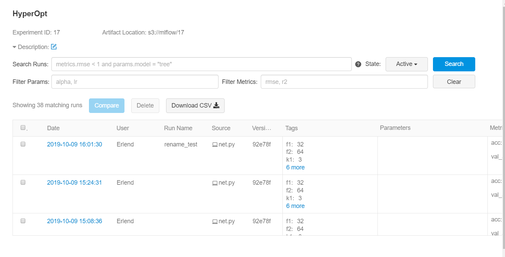
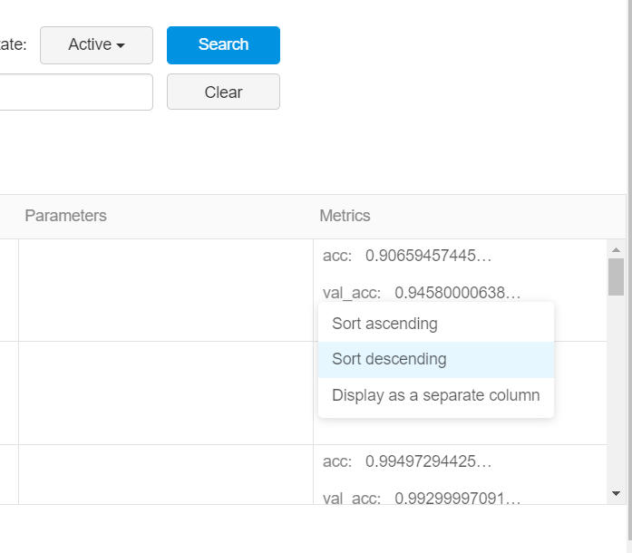
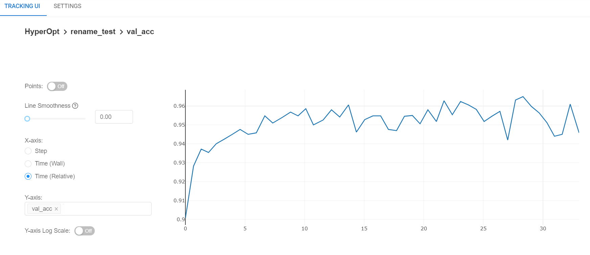

# Hyperparameter Optimalization with MFlux
Most machine learning models require us to make specifications about them. Say we want to use a Convolutional
Neural Network to classify handwritten digits using the famous MNIST dataset. Great, but how many layers will it 
have? How many filters in the convolutional layers? Will we use dropout and so on? We will need to run tests 
to figure out the best configuration.

MFlux makes keeping track of and comparing such test runs easy.

_Running the experiment in this tutorial will be quick and easy for the human, but the machine will have to work a long time, 
likely several hours._

## Prerequisites
Create a new environment and run the following installations
`conda install python=3.7`
`pip install numpy==1.17 tensorflow==2 mlflow==1.3 boto3 keras==2.3 mflux_ai==0.5.1 scikit-learn==0.21`


## Get and Prepare Data
Make a folder in a suitable location and call it, for instance, `MNIST`. 
We can get the MNIST dataset directly from Keras. Create a python file for the project. Import what we will need, initialize 
MFlux, set an experiment for this tutorial and prepare the data:
```python
import numpy as np
from tensorflow import keras
import mlflow
import mlflow.keras
import mflux_ai
from sklearn.model_selection import train_test_split as ttsplit

mflux_ai.init("your_token_goes_here")
mlflow.set_experiment("MNIST hyperopt")


def one_hot_target(target):
    oh_target = np.zeros((len(target), 10))
    for i in range(len(target)):
        oh_target[i][int(target[i])] = 1
    return oh_target


(train, target), (test, test_target) = keras.datasets.mnist.load_data()
train = train / 255
test = test / 255
target = one_hot_target(target)
test_target = one_hot_target(test_target)
train = np.expand_dims(train, axis=3)
train, val, target, val_target = ttsplit(train, target, test_size=0.1)
```
The function `one_hot_target()` turns the entries in the 
target array from the form `[7]` to the form `[0, 0, 0, 0, 0, 0, 0, 1, 0, 0]`.


## The Network
We define a function that will build the network, making it easy to tweak certain hyperparameters. We use two layers of 
convolutions (knowing in advance that this is a reasonable choice for the task) with pooling after each and one dense layer 
at the end. We add dropout after each of these and flatten the output from the convolutions beforehand.

The model needs to be logged to MFlux of course, but we also log a set of tags. These are the hyperparameters in question, 
so we can easily see in the MFlux tracking upi what structure a particularly successful network has. Logging the history 
of metrics is nice, so we see how the network develops.
```python
def make_model(filters, k1, k2, dense, dropout, epochs, batch_size):
    model = keras.models.Sequential()
    model.add(keras.layers.Conv2D(filters=filters, kernel_size=k1, strides=1, input_shape=(28, 28, 1),
                                  activation='relu', padding="same"))
    model.add(keras.layers.MaxPooling2D(pool_size=2))
    model.add(keras.layers.Dropout(dropout))
    model.add(keras.layers.Conv2D(filters=filters * 2, kernel_size=k2, strides=1, activation='relu'))
    model.add(keras.layers.MaxPooling2D(pool_size=2))
    model.add(keras.layers.Dropout(dropout))
    model.add(keras.layers.Flatten())
    model.add(keras.layers.Dense(dense))
    model.add(keras.layers.Dropout(dropout))
    model.add(keras.layers.Dense(10, activation='softmax'))
    model.compile(optimizer=keras.optimizers.Adam(), loss="categorical_crossentropy", metrics=["accuracy"])
    model.summary()
    history = model.fit(train, target, epochs=epochs, batch_size=batch_size, validation_data=(val, val_target))
    with mlflow.start_run() as run:
        mlflow.keras.log_model(model, "model")
        tags = {'filters': filters, 'k1': k1, 'k2': k2, 'dense': dense, 'dropout': dropout, 'epochs': epochs,
                'batch_size': batch_size}
        mlflow.set_tags(tags)
        for i in range(0, epochs, 1):
            mlflow.log_metric(key="val_acc", value=history.history["val_accuracy"][i], step=i)
            mlflow.log_metric(key="acc", value=history.history["accuracy"][i], step=i)
    error = model.evaluate(val, val_target, verbose=0)
    return model, error
```
Notice: We are choosing a random subset of 6000 validation images for every network we train. This may sound like a lot, but 
most networks will score somewhere above 99% accuracy. This means we have less than 60 "tricky" images per validation set. 
At this size, randomness can make itself know. If a network scores better on the validation set than the training set, it may 
be that the validation set simply contains few hard cases.


## Optimizing
Now we can call this function with various inputs to look for the best setup. Training one model for 30 epochs takes around 
10 minutes, depending on the computer it is run on. If we have 5 hyperparameters we are intrested in 
(filters, k1, k2, dense, dropout) running every combination of two alternatives for each would take 10 * 2 ^ 5 = 320 minutes, 
or 5 hours. Also, since training a network involves some amount of randomness, we should train at least 2 or 3 of each and 
average their scores.

We decided to try 3 options for each hyperparameter, but not trying every combination. We guess a decent start point 
(after having done some initial tests) and try changing one at a time, running 3 times per setup. We keep the best value 
and move on to the next. This does not take account for how changing one hyperparameter may move the optimum for a different
hyperparameter, but it does have the upside of getting an overview of the space (comparatively) quickly.

Below is the test for the `filters` hyperparameter. In our test 32 scored slightly better than 16, 
we note this but keep 16 for the next test to train a little faster.
```python
make_model(8, 4, 5, 32, 0.2, 30, 100)
make_model(8, 4, 5, 32, 0.2, 30, 100)
make_model(8, 4, 5, 32, 0.2, 30, 100)
make_model(16, 4, 5, 32, 0.2, 30, 100)
make_model(16, 4, 5, 32, 0.2, 30, 100)
make_model(16, 4, 5, 32, 0.2, 30, 100)
make_model(32, 4, 5, 32, 0.2, 30, 100)
make_model(32, 4, 5, 32, 0.2, 30, 100)
make_model(32, 4, 5, 32, 0.2, 30, 100)
```

## Choosing a model
The main page for this experiment in MFlux will look something like this


We can sort valuation accuracy by descending to see the models that perform best on images not seen during training


By clicking on a run (under "Date") we can see more details about it. This is the graph for valuation accuracy over time for 
one of our runs


After training several models with varying input in the fields `filters, k1, k2, dense, dropout`, we examine them in MFlux 
and settle on 
```python
make_model(32, 7, 7, 32, 0.1, 30, 100)
make_model(32, 7, 7, 32, 0.1, 30, 100)
make_model(32, 7, 7, 32, 0.1, 30, 100)
```

We pick the best model after the training is done.

## Going further
The best honest entries in the Kaggle comptition currently score around 99.7 % (on the unseen part of the data, the way it is split
on Kaggle). Here are some suggestions for how to get closer to this score:
* Obtain more powerful hardware and use GPU computing (for instance with CUDA). Speeding up training will let us do more 
involved searches.
* Use a smarter approach for the search +++
* Look into more advanced network techniques like batch normalization, a deeper network or swapping the pooling layers 
for convolutional layers.
* Use a callback during training to keep the best model.
* Apply tweaks like strech and rotation to the data to artificially increase the dataset in size.
* Use an average of many good networks.
* Investigate the mislabled output images for ideas on what the network is struggling with.

