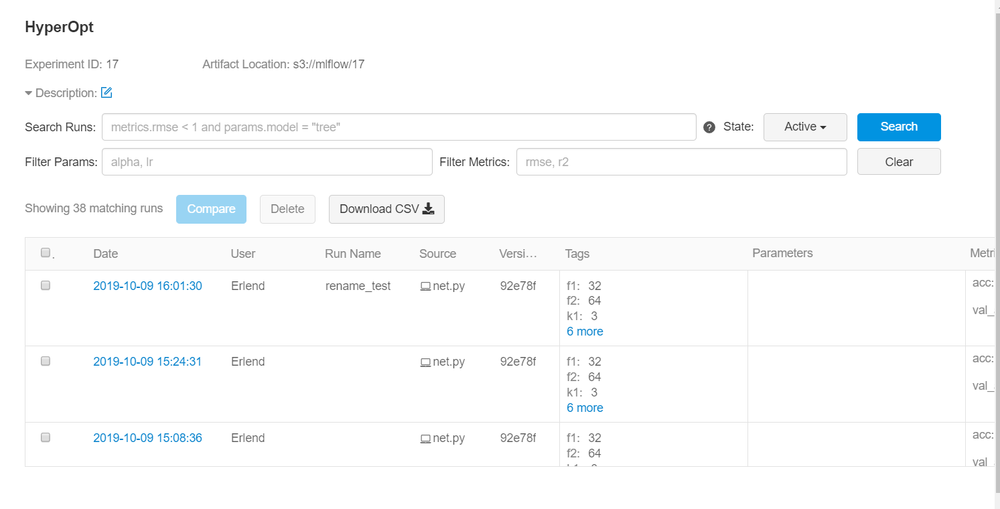
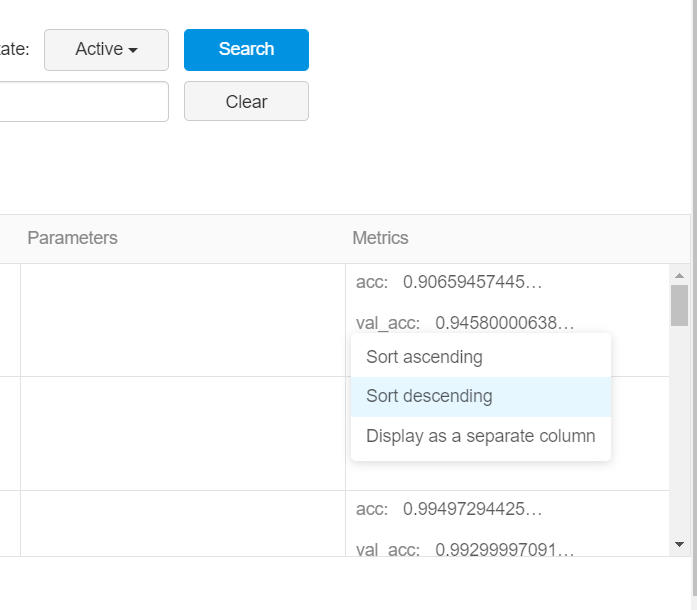
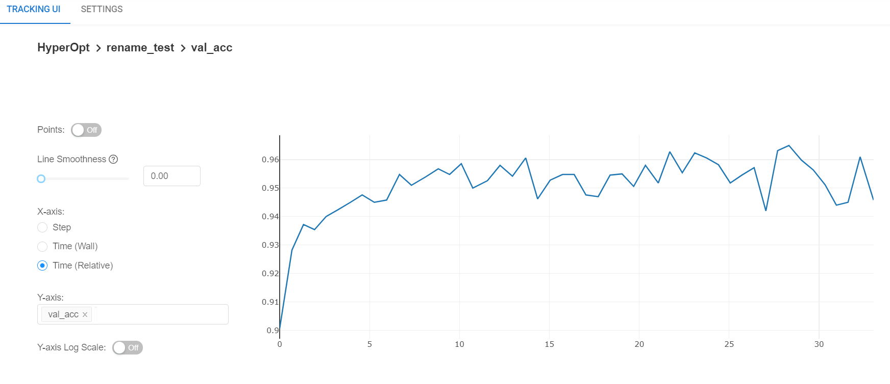

# Hyperparameter Optimalization with MFlux and Hyperas
Most machine learning models require us to make specifications about them. Say we want to use a Convolutional
Neural Network to classify handwritten digits using the famous MNIST dataset. Great, but how many layers will it 
have? How many filters in the convolutional layers? Will we use dropout and so on? We will need to run tests 
to figure out the best configuration.

MFlux.ai makes keeping track of and comparing such test runs easy. We will use Hyperas to run the optimization.

_Running the experiment in this tutorial will be quick and easy for the human, but the machine will have to work a long time, 
likely several hours._

## Prerequisites
Create a new environment and run the following installations:

```
conda install python=3.7
```

```
pip install numpy==1.17 tensorflow==2 mlflow[extras]==1.3 keras==2.3 mflux_ai>=0.5.3 scikit-learn==0.21 hyperas==0.4
```


## Get and Prepare Data
Make a folder in a suitable location and call it, for instance, `MNIST`. Create a python file for the project.

Here are the imports that we will need to start off:
```python
import mflux_ai
import mlflow.keras
from hyperas import optim
from hyperas.distributions import uniform, quniform
from hyperopt import Trials, STATUS_OK, tpe
```

Initialize MFlux.ai and set an experiment to store the models we will train in:
```python
mflux_ai.init("your_key_goes_here")
mlflow.set_experiment("MNIST hyperas")
```

It is an oddity of Hyperas that it prefers us to load and prepare the data in a function. This is to avoid loading the 
data anew for every model. The same goes for imports specific to the data preparation, like so:
```python
def get_data():
    from keras.datasets import mnist
    import numpy as np
    (X_train, y), (X_test, y_t) = mnist.load_data()
    X_train = X_train / 255                     # network performs better with values in [0, 1]
    X_train = np.expand_dims(X_train, axis=3)   # format required by keras Conv2D
    X_test = X_test / 255
    X_test = np.expand_dims(X_test, axis=3)
    Y_train = np.zeros((len(y), 10))
    for i in range(len(y)):                     # y contains elements of format [7]
        Y_train[i][int(y[i])] = 1               # Y_train contains elements of format
    Y_test = np.zeros((len(y_t), 10))           # [0, 0, 0, 0, 0, 0, 0 , 1, 0, 0]
    for i in range(len(y_t)):                   # (improves network performance)
        Y_test[i][int(y_t[i])] = 1
    return X_train, Y_train, X_test, Y_test
```

We will call this function later as input to `hyperas.optim()`.


## Defining the model

Hyperas requires us to define the model in a function. Notice that the input is simply the output from `get_data()`. The 
hyperparameters are defined inside the function, with the distributions they are to be drawn from. Aside from this, the 
network is built us usual in keras, and the logging to MFlux.ai is also done in the familiar way. The final line returns a 
dict with loss (the value to be minimized by `hyperas.optim()`). Note that it is possible to also include the model in the
returned dict, but that may introduce a risk of getting a memory leak, so we are not doing that here.

```python
def train_model(X_train, Y_train, X_test, Y_test):
    from tensorflow import keras
    f1 = {{quniform(8, 64, 4)}}  # defining the variables to optimize
    k1 = {{quniform(3, 10, 1)}}  # and the valid values for them
    d1 = {{uniform(0, 1)}}
    f2 = {{quniform(8, 128, 4)}}  # quniform(min, max, q) means uniform(min, max) with step size q
    k2 = {{quniform(3, 10, 1)}}
    d2 = {{uniform(0, 1)}}
    dense = {{quniform(8, 128, 4)}}
    d3 = {{uniform(0, 1)}}
    bs = {{quniform(10, 1000, 10)}}
    epochs = 2
    # defining the network
    model = keras.models.Sequential()
    model.add(keras.layers.Conv2D(filters=int(f1), kernel_size=int(k1), strides=1,
                                  input_shape=(28, 28, 1), activation='relu', padding="same"))
    model.add(keras.layers.MaxPooling2D(pool_size=2))
    model.add(keras.layers.Dropout(d1))
    model.add(keras.layers.Conv2D(filters=int(f2), kernel_size=int(k2), strides=1,
                                  activation='relu'))
    model.add(keras.layers.MaxPooling2D(pool_size=2))
    model.add(keras.layers.Dropout(int(d2)))
    model.add(keras.layers.Flatten())
    model.add(keras.layers.Dense(int(dense)))
    model.add(keras.layers.Dropout(int(d3)))
    model.add(keras.layers.Dense(10, activation='softmax'))
    model.compile(
        optimizer=keras.optimizers.Adam(), loss="categorical_crossentropy", metrics=["accuracy"]
    )
    model.summary()
    history = model.fit(
        X_train, Y_train, epochs=epochs, batch_size=int(bs), validation_data=(X_test, Y_test)
    )
    # logging to MFlux.ai:
    with mlflow.start_run() as run:
        mlflow.keras.log_model(model, "model")
        tags = {
            'f1': f1, 'f2': f2, 'k1': k1, 'k2': k2, 'd1': d1, 'd2': d2, 'd3': d3, 'dense': dense,
            'batch_size': bs
        }
        mlflow.set_tags(tags)
        for i in range(epochs):
            mlflow.log_metric(key="val_acc", value=history.history["val_accuracy"][i], step=i)
            mlflow.log_metric(key="acc", value=history.history["accuracy"][i], step=i)
    score, acc = model.evaluate(X_test, Y_test, verbose=0)
    return {'loss': -acc, 'status': STATUS_OK}
```

## Running the Search
Finally we call the function to actually do the optimization. Currently `epochs = 2` in `model()` and `max_evals=2` in the 
following. This is to gauge the runtime and behaviour of the script before setting them to something useful, like `epochs = 25` 
and `max_evals=15`.
```python
best_run, _ = optim.minimize(
    model=train_model, data=get_data, algo=tpe.suggest, max_evals=2, trials=Trials()
)
print("Recommended hyper-parameters:")
print(best_run)
```


## Inspecting the Models
All the trained models have now been logged to MFlux.ai, with the tags telling us what the hyperparameters are set to and a
history of accuracy and validation accuracy per epoch.

The main page for this experiment in MFlux.ai will look something like this


We can sort validation accuracy by descending to see the models that perform best on images not seen during training


By clicking on a run (under "Date") we can see more details about it. This is the graph for validation accuracy over time for 
one run



## Other hyperparameter tuning libraries

We used Hyperas in this tutorial, but there are many other libraries for hyperparameter optimization, for example:

* [Nevergrad](https://github.com/facebookresearch/nevergrad)
* [Hyperopt](https://github.com/hyperopt/hyperopt) (hyperas is a wrapper around hyperopt)
* [Keras-tuner](https://github.com/keras-team/keras-tuner)
* [Talos](https://github.com/autonomio/talos)
* [SHERPA](https://parameter-sherpa.readthedocs.io/en/latest/)
* [Scikit-learn](https://scikit-learn.org/stable/modules/classes.html#hyper-parameter-optimizers) also has some built-in 
hyperparameter optimization alrogithms

## Going Further

The best honest entries in the rolling MNIST Kaggle competition currently score around 99.7 % (on the unseen part of the data, the way it is split
on Kaggle). Here are some suggestions for how to get closer to this score:
* Obtain more powerful hardware and use GPU computing (for instance with CUDA). Speeding up training will let us do more 
involved searches.
* Look into more advanced network techniques like batch normalization, a deeper network or swapping the pooling layers 
for convolutional layers.
* Make one or more hyperparameters that decide if more layers are to be used in the model.
* Use a callback during training to keep the best model.
* Apply tweaks like stretch and rotation to the data to artificially increase the dataset in size.
* Use an average of many good networks.
