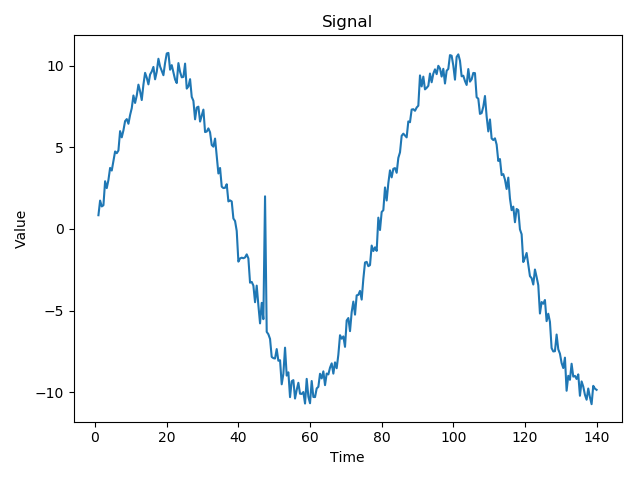
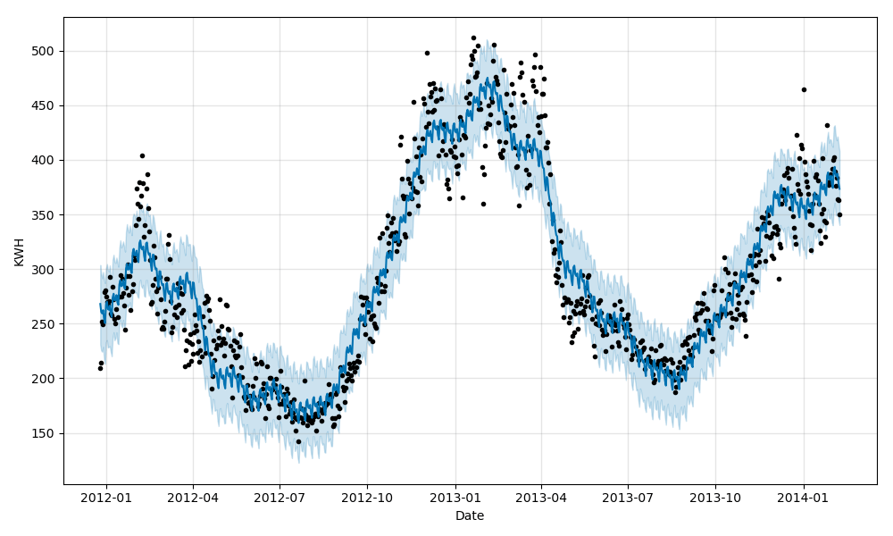
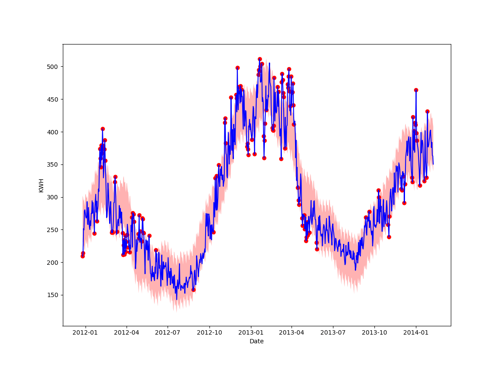

# Unsupervised anomaly detection in time series


## Install Anaconda on your computer

Download and install Anaconda. Select the Python 3.* version):
https://www.anaconda.com/download/

When Anaconda is installed, open "Anaconda Prompt" or any other terminal where you have ```conda``` available now.

## Make an isolated Python environment
Run ```conda create --name anomaly-detection python=3.6``` in your terminal.
Then, to activate your new environment, run ```conda activate anomaly-detection```.


##  Install the required packages

Run ```pip install mlflow[extras]==1.2.0 "mflux-ai>=0.3.0" matplotlib==3.0.0  fbprophet==0.3.post2 boto3==1.9.215```  in your terminal.

## Tutorial

In this tutorial, we will create an unsupervised anomaly detection model for time series. Anomaly detection for time series can be formulated as finding outlier data points relative to some standard or usual signal.
It will input a time series and detect abnormal time series points. The figure below shows
an example of a time series with one abnormal data point.



We will focus on unsupervised learning, i.e we do not have labeled data points. We will use
the [Facebook Prophet library](https://github.com/facebook/prophet) for modeling our time series.

## The data set

The data set contains  energy consumption readings in kWh (per half hour) for a sample of London Households that took part in the
UK Power Networks led Low Carbon London project between November 2011 and February 2014. More information about the project can be found
 [here](https://data.london.gov.uk/dataset/smartmeter-energy-use-data-in-london-households?resource=3527bf39-d93e-4071-8451-df2ade1ea4f2).

You can download the data set [here](https://data.london.gov.uk/download/smartmeter-energy-use-data-in-london-households/04feba67-f1a3-4563-98d0-f3071e3d56d1/Power-Networks-LCL-June2015(withAcornGps).csv_Pieces.zip).

## Library imports
```python
import fbprophet
import matplotlib.pyplot as plt
import pandas as pd
```

## Import data
Import the data set into a pandas dataframe
```python
df = pd.read_csv('Power-Networks-LCL-June2015(withAcornGps)v2_1.csv', header=0)

```

## Data pre-processing

Convert the date string field into a pandas datetime type
```python
df['date'] = pd.to_datetime(df['DateTime'])
```

Extract date and consumption columns and set the date as the index.


```python
data = df.loc[:, ['KWH/hh (per half hour) ']]
data = data.set_index(df.date)
```

Next, we will resample the time series. Resampling involves changing the frequency of your time series observations.
We want to resample by day by aggregating kwH during this period.


```python
data['KWH/hh (per half hour) '] = pd.to_numeric(data['KWH/hh (per half hour) '], downcast='float', errors='coerce')
daily = data.resample('D').sum()
daily.reset_index(inplace=True)
```

In order to use Prophet, we need to rename our columns. The date column must be called 'ds'
and the value we want to predict 'y'.

```python
daily = daily.rename(columns={'date': 'ds', 'KWH/hh (per half hour) ': 'y'})
```

Next, we convert the date column to the format Prophet uses.

```python
daily['ds'].apply(lambda x: x.strftime('%Y-%m-%d'))
```

## Modeling
Now we can create a model, fit it to the data and make a forecast.

```python
model = fbprophet.Prophet()
model.fit(daily)
forecast = model.predict(daily)
```


The forecast dataframe includes a columns 'yhat' with the forecast, as well as
columns for uncertainty intervals: yhat_lower and yhat_lower. The following
code makes a plot of the actual value, the forecast and the uncertainty intervals.

```python
model.plot(forecast, xlabel='Date', ylabel='KWH')
plt.show()
```



We set as anomalies everything higher than the top and lower the bottom of the uncertainty intervals.
We make a new anomaly column in the forecast dataframe. If a data point is inside the model boundary
we set the column value to 0. Anomalies are marked with 1s.

```python
forecast['actual'] = daily['y'].reset_index(drop=True)
forecast['anomaly'] = 0
forecast.loc[forecast['actual'] > forecast['yhat_upper'], 'anomaly'] = 1
forecast.loc[forecast['actual'] < forecast['yhat_lower'], 'anomaly'] = 1
```


We can now calculate anomaly statistics.

```python
n_obs = forecast.shape[0]
n_anomalies = forecast['anomaly'].sum()
n_normal = n_obs - n_anomalies
print("There are {} anomalies and {} normal data points. {} % of the data points are anomalies."
.format(n_anomalies,n_normal,int((n_anomalies / n_normal) * 100)))                                                                                                        n_normal,
```


We can also make plot which paints anomaly points red.
```python
ax = plt.gca()
ax.plot(forecast['ds'].values, forecast['actual'].values, 'b-')
ax.scatter(forecast[forecast['anomaly'] == 1]['ds'].values,
            forecast[forecast['anomaly'] == 1]['actual'].values, color='red')
ax.fill_between(forecast['ds'].values, forecast['yhat_lower'].values, forecast['yhat_upper'].values,
                    alpha=0.3, facecolor='r')
plt.xlabel("Date")
plt.ylabel("KWH")
plt.show()
```



## MLflow and custom models

Facebook Prophet is not explicitly supported by MLflow. Fortunately, MLflow supports custom python models.
The ``mlflow.pyfunc`` module provides utilites for creating MLFlow models
that contains user-spesific code and artifact(file) dependencies.
These artifact dependencies may include serialized models produced by any Python ML library.

We will show how you can use ```mlflow.pyfunc``` for saving and loading the
unsupervised anomaly model.


### Saving and loading a custom Facebook Prophet model in MLflow format

We save the trained Prophet model using pickle.
```python
import pickle

pkl_path = "prophet_model.pkl"
with open(pkl_path, "wb") as f:
    pickle.dump(model, f)
```

Next, we define a dictionary that assigns a unique name to the saved Prophet model file.

```python
artifacts = {
    "prophet_model": pkl_path
}
```

We define a wrapper class around the Facebook Prophet model. It has a custom
predict method which first performs forecast using our trained model and afterwards labels the
data points using the uncertainty intervals.

```python
import mlflow.pyfunc

class ProphetWrapper(mlflow.pyfunc.PythonModel):

    def load_context(self, context):
        with open(context.artifacts["prophet_model"], "rb") as f:
            model = pickle.load(f)
        self.prophet_model = model

    def predict(self, context, model_input):
        forecast = self.prophet_model.predict(model_input)
        forecast['anomaly'] = 0
        forecast['actual'] = model_input['y'].reset_index(drop=True)
        forecast.loc[forecast['actual'] > forecast['yhat_upper'], 'anomaly'] = 1
        forecast.loc[forecast['actual'] < forecast['yhat_lower'], 'anomaly'] = 1
        return forecast['anomaly'].values
```

We create a dict which defines a Conda environment for the new MLflow model.
It contains the Prophet library as a dependency, as well as the required CloudPickle library.

```python
conda_env = {
    'channels': ['defaults'],
    'dependencies': [
        'fpprophet={}'.format(fbprophet.__version__),
        'cloudpickle={}'.format(cloudpickle.__version__),
    ],
    'name': 'fprohpet_env'
}
```

Save the MLflow model.

```python
mlflow_pyfunc_model_path = "prophet_mlflow_pyfunc"
mlflow.pyfunc.save_model(
    path=mlflow_pyfunc_model_path, python_model=ProphetWrapper(), artifacts=artifacts,
    conda_env=conda_env)
```

Log the metrics and store the model in MFlux.ai.

```python
mlflow.log_metric("anomaly_ratio",anomaly_ratio)
mlflow.log_metric("n_anomalies",n_anomalies)
mlflow.log_metric("n_normal", n_normal)
mlflow.pyfunc.log_model(artifact_path=mlflow_pyfunc_model_path, python_model=ProphetWrapper(), artifacts=artifacts,
    conda_env=conda_env)
```
