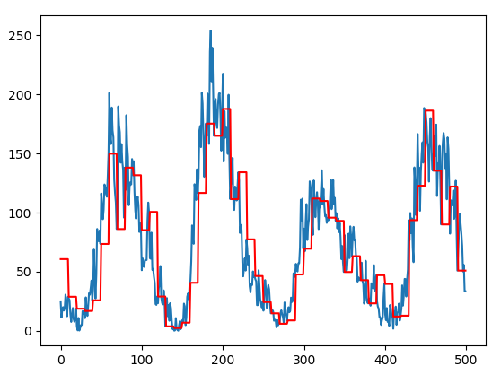
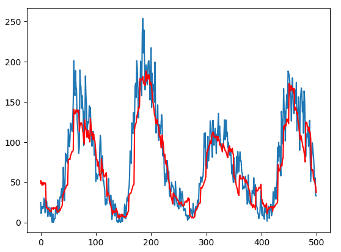

# Time series forecasting tutorial
Time series forecasting is used in finance, meteorology, budgeting, logistics and any endeavor that has a lot to gain 
by good predictions.

Time series forecasting typically means predicting the future by observing the past. For example, predicting future 
sales based on past and current parameters.

In this tutorial we will get started with time series forecasting using autoregression (AR) models.

_It should be pointed out that time series forecasting, a.k.a. predicting the future, is often very difficult or entirely 
impossible. Success, with an appropriate approach, relies on patterns in the data that will hold into the future, and should 
be measured relative to other forecasting models._

## Setting it up

To manage our dependencies we will use Anaconda. You can get it here:

[https://www.anaconda.com/download/](https://www.anaconda.com/download/) (make sure to get the python 3 version)

Open an Anaconda Prompt and create an environment for the tutorial:
`conda create -n sunspots`

We will need:
* Python
* Pandas
* Matplotlib
* scikit-learn

```
conda install python=3.6.6 pandas=0.25.1 matplotlib=3.1.1 scikit-learn=0.21 statsmodels==0.10.1
```
```
pip install mflux-ai>=0.6.0 mlflow[extras]==1.3.0
```

In mlflow/examples create a folder called ```time_series_tutorial```.
In this create a file called ```sunspots.csv``` and a python file called ```tutorial.py```

Open Anaconda Prompt and cd into mlflow/examples.

### Download the dataset
Data sets for time series are often a lot smaller than for other ML methods, 
to download this one, you can simply go to
[https://raw.githubusercontent.com/jbrownlee/Datasets/master/monthly-sunspots.csv](https://raw.githubusercontent.com/jbrownlee/Datasets/master/monthly-sunspots.csv),
select all, copy the whole thing and paste it into sunspots.csv.

### Forecasting with Autoregression
Now to import the data into our python file, type or paste this into tutorial.py:
```python
import pandas as pd
data = pd.read_csv('sunspots.csv')
```

In a time series the distance between two neighbouring points is always the same,
so we can drop the time index
```python
X = data.Sunspots.values
```

Now X is just an array of observations, in chronological order. For instance, adding
```python
print(X[100:110])
```

to the bottom of the python file gives the output
```
[38.1 12.8 25.  51.3 39.7 32.5 64.7 33.5 37.6 52. ]
```

Run the file from the `time_series_tutorial` folder with Anaconda prompt:
```
python tutorial.py
```

showing what X looks like without the time index

Now we want to split the data into a training set and a test set. For a time series,
the test set will be the last part of the series. Let's make a variable to control where to split the data,
and then split it
```python
test_n = 500
train = X[:-test_n]
test = X[-test_n:]
```

Let's add a variable to control how many steps ahead we are to forecast.
```python
forecast_steps = 10
```

To keep this tutorial simple, we will not support cases where `test_n / forecast_steps` is not an integer.

As a baseline to compare our results against, we make a naive_forecast method.
This method will always predict that the next value is the same as the last,
for as long in to the future as we ask it.
```python
def naive_forecast(history):
    predictions = []
    for i in range(0, test_n, forecast_steps):
        forecast = [history[-1]] * forecast_steps
        predictions.extend(forecast)
        last_obs = test[i + forecast_steps -1]
        history.append(last_obs)
    return predictions
```

Now, let's run a naive forecast and inspect it.
We will want pyplot to visualise the output and use mean squared error (MSE) as a measure of accuracy.
```python
from matplotlib import pyplot
from sklearn.metrics import mean_squared_error
```

Then to do the forecast, give it a score with MSE and plot it
```python
predictions = naive_forecast(history)
error = mean_squared_error(predictions, test)
print('The naive prediction has MSE: ', error)
pyplot.plot(test)
pyplot.plot(predictions, color="red")
pyplot.show()
```

When we now run python time_series_tutorial/tutorial.py from mlflow/examples in an Anaconda Prompt,
we should get and MSE of 1023 and this plot



Now, let's add a simple AR-model (autoregression) to forecast our series.
```python
from statsmodels.tsa.ar_model import AR
```

This method implements a first stab at AR-modeling:
```python
def AR_forecast(history):
    predictions = []
    model = AR(history)
    model = model.fit()
    coefs = model.params
    for i in range(0, test_n, forecast_steps):
        forecasting_base = history[:]
        for j in range(forecast_steps):
            forecast_value = coefs[0]
            for k in range(1, len(coefs)):
                forecast_value += coefs[k] * forecasting_base[-k]
            predictions.append(forecast_value)
            forecasting_base.append(forecast_value)
        history.extend(test[i:i+forecast_steps])
    return predictions, model
```

Let's go through it. The history variable starts as the training data, but as we make predictions and move forward in time,
it will get appended with data from the test data that has "just become available" to us.
The predictions variable will store all our predictions.

We specify that we are using the AR model on the training data and fit it. The variable coefs hold the 
coefficients calculated by the model.
These are weights to be applied to the last few elements of our time series in order to forecast the next 
element
```python
model = AR(history)
model_fit = model.fit()
coefs = model_fit.params
```

We have chosen to do one forecast every few steps, and no forecasting in between.
Here we loop over the relevant time steps to do forecasting. In order to forecast more than one step,
we will use the output of one forecast as input for the next one.
Because we will be appending forecasts to the actual historical data, we make an other variable for this.
```python
    for i in range(0, test_n, forecast_steps):
        forecasting_base = history[:]
```

This loop calculates all forecasts made at one point in time:
```python
        for j in range(forecast_steps):
            forecast_value = coefs[0]
            for k in range(1, len(coefs)):
                forecast_value += coefs[k] * forecasting_base[-k]
            predictions.append(forecast_value)
            forecasting_base.append(forecast_value)
        history.extend(test[i:i+forecast_steps])
    return predictions, model
```

The formula is

`forecast = coefs[0] + coefs[1] * history[-1] + ... + coefs[n] * history[-n]`

We save the forecast and append it to `forecasting_base` to be used as our best guess to calculate the next forecast.

Before the next forecast we add data that will by then have been observed.
Finally, to run the correct model and evaluate it we change
```python
predictions = naive_forecast()
```

to
```python
predictions = AR_forecast()
```
When we run the code now, we get an MSE of 638 and this plot



### Upload to Mflux
To upload the model to Mflux:
```python
mflux_ai.init("your_token_goes_here")
experiment_id = mlflow.set_experiment("Sunspots")
mlflow.log_metric("mse", error)
mlflow.sklearn.log_model(model, "model")
```

### The whole code:
```python
import mflux_ai
import mlflow.sklearn
import pandas as pd
from matplotlib import pyplot
from sklearn.metrics import mean_squared_error
from statsmodels.tsa.ar_model import AR

data = pd.read_csv('sunspots.csv')
X = data.Sunspots.values
test_n = 500
train = X[:-test_n]
test = X[-test_n:]
forecast_steps = 10
history = list(train)


def naive_forecast(history):
    predictions = []
    for i in range(0, test_n, forecast_steps):
        forecast = [history[-1]] * forecast_steps
        predictions.extend(forecast)
        last_obs = test[i + forecast_steps -1]
        history.append(last_obs)
    return predictions


predictions = naive_forecast(history)
error = mean_squared_error(predictions, test)
print('The naive prediction has MSE: ', error)
pyplot.plot(test)
pyplot.plot(predictions, color="red")
pyplot.show()


def AR_forecast(history):
    predictions = []
    model = AR(history)
    model = model.fit()
    coefs = model.params
    for i in range(0, test_n, forecast_steps):
        forecasting_base = history[:]
        for j in range(forecast_steps):
            forecast_value = coefs[0]
            for k in range(1, len(coefs)):
                forecast_value += coefs[k] * forecasting_base[-k]
            predictions.append(forecast_value)
            forecasting_base.append(forecast_value)
        history.extend(test[i:i+forecast_steps])
    return predictions, model


predictions, model = AR_forecast(history)
error = mean_squared_error(predictions, test)
print('The AR-forecast has MSE: ', error)
pyplot.plot(test)
pyplot.plot(predictions, color="red")
pyplot.show()

mflux_ai.init("your_token_goes_here")
experiment_id = mlflow.set_experiment("Sunspots")
mlflow.log_metric("mse", error)
mlflow.sklearn.log_model(model, "model")
```
